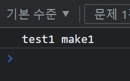
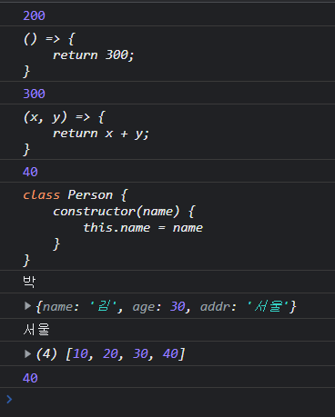
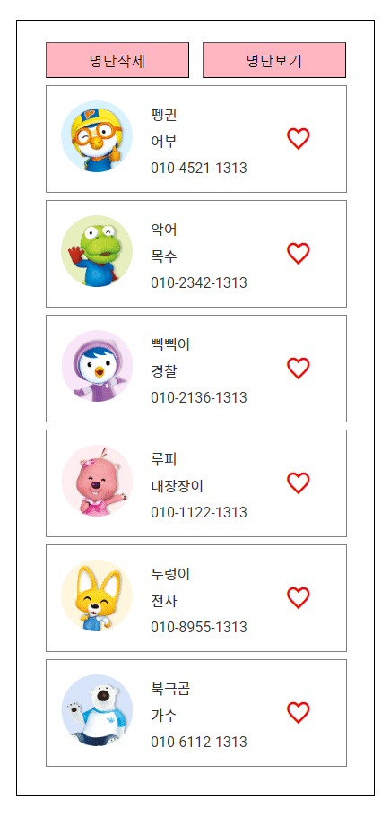

# module-assignment

1. ## module


   - script를 여러 파일로 분리한 후 사용할 수 있다.
   - array, function, class 등을 하나의 파일로 분리 해 필요할 때 불러와 사용한다.
   - 확장성, 유지/보수, 디버깅에 용이하다는 장점이 있다.
2. ## module 기본 사용법


   - ```javascript
     export function make1(msg){
         console.log(msg, 'make1');
     }
     ```
     javascript 파일 작성 시 export를 넣어 파일 밖으로 내보낸다.
   - ```html
       <script type="module">
         import {make1} from './module/test1.js';
         make1('test1');
       </script>
     ```
     html에서 script 작성 시 type="module"을 추가해 주고 import로 내보낸 script의 함수를 받는다.

     
3. ## module 추가 사용법


   - ```javascript
     const num = 200;
     const make1 = () => {
         return 300;
     }
     const make2 = (x, y) => {
         return x + y;
     }
     const make3 = (x, y) => {
         return x * y
     }
     class Person {
         constructor(name) {
             this.name = name
         }
     }
     const obj = {
         name: '김', age: 30, addr: '서울'
     }
     const arr = [10, 20, 30, 40]

     export { num, make1, make2, Person, obj, arr }

     export default make3
     ```

   위 코드 처럼 function 뿐만 아니라 매개변수가 들어있는 function, 객체, 배열, class를 모두 module로 만들 수 있다.

   - ```html
       <script type="module">
         import { num, make1, make2, Person, obj, arr } from "./module/test2.js";
         console.log(num);
         console.log(make1);
         console.log(make1());
         console.log(make2);
         console.log(make2(10,30));
         const man = new Person()
         man.name = '박'
         console.log(Person);
         console.log(man.name);
         console.log(obj);
         console.log(obj.addr);
         console.log(arr);
         console.log(arr[3]);
       </script>
     ```
     
4. ## module 예제

   #### 구현 기능


   - 명단삭제 / 명단보기

     
   - 좋아요

     

   1. step #1 (module 사용 X)

   ```javascript
     <script type="module">
         const arr = [
             { name: '펭귄', img: 'img0.png', job: '어부', tel: '010-4521-1313' },
             { name: '악어', img: 'img1.png', job: '목수', tel: '010-2342-1313' },
             { name: '삑삑이', img: 'img2.png', job: '경찰', tel: '010-2136-1313' }
             { name: '루피', img: 'img3.png', job: '대장장이', tel: '010-1122-1313'}
             { name: '누렁이', img: 'img4.png', job: '전사', tel: '010-8955-1313' }
             { name: '북극곰', img: 'img5.png', job: '가수', tel: '010-6112-1313' }
         ]
         let ul = document.querySelector('ul')
         let del = document.querySelector('.del')
         let show = document.querySelector('.show')
         let i = document.querySelectorAll('i')
         function showList() {
             ul.innerHTML = ''
             const newObj = arr.map(ele => {
                 const { name, img, job, tel } = ele;
                 return `
         <li>
         
         <strong>
             <p>${name}</p>
             <p>${job}</p>
             <p>${tel}</p>
         </strong>
         <i class="xi-heart-o"></i>
         </li>
         `
             }).join('')
             ul.innerHTML = newObj;
             i = document.querySelectorAll('i')
             i.forEach(ele => {
                 ele.addEventListener('click', e => {
                     if (e.target.className === 'xi-heart-o') {
                         e.target.className = 'xi-heart'
                     } else {
                         e.target.className = 'xi-heart-o'
                     }
                 })
             })
         }
         del.addEventListener('click', e => {
             ul.innerHTML = ''
         })
         show.addEventListener('click', e => {
             showList();
         })
         showList();
     </script>
   ```
   script 전체 내용을 html에 넣었다.

   2. step #2 (arr 배열 module 분리)

   ```javascript
     export const arr = [
         {name : '펭귄', img : 'img0.png', job : '어부', tel : '010-4521-1313'},
         {name : '악어', img : 'img1.png', job : '목수', tel : '010-2342-1313'},
         {name : '삑삑이', img : 'img2.png', job : '경찰', tel : '010-2136-1313'},
         {name : '루피', img : 'img3.png', job : '대장장이', tel : '010-1122-1313'},
         {name : '누렁이', img : 'img4.png', job : '전사', tel : '010-8955-1313'},
         {name : '북극곰', img : 'img5.png', job : '가수', tel : '010-6112-1313'}
     ]
   ```
   ```javascript
       <script type="module">
     import { arr } from "./module/arr.js";

     let ul = document.querySelector('ul')
     let del = document.querySelector('.del')
     let show = document.querySelector('.show')
     let i = document.querySelectorAll('i')

     function showList() {
         ul.innerHTML = ''
         const newObj = arr.map(ele => {
             const { name, img, job, tel } = ele;
             return `
     <li>
     
     <strong>
         <p>${name}</p>
         <p>${job}</p>
         <p>${tel}</p>
     </strong>
     <i class="xi-heart-o"></i>
     </li>
     `
         }).join('')
         ul.innerHTML = newObj;
         i = document.querySelectorAll('i')
         i.forEach(ele => {
             ele.addEventListener('click', e => {
                 if (e.target.className === 'xi-heart-o') {
                     e.target.className = 'xi-heart'
                 } else {
                     e.target.className = 'xi-heart-o'
                 }
             })
         })
     }
     del.addEventListener('click', e => {
         ul.innerHTML = ''
     })
     show.addEventListener('click', e => {
         showList();
     })
     showList();
     </script>
   ```
   arr 객체를 arr.js로 분리한 후 export하고 html에서 import 해 주었다.

   3. step #3 (arr 배열, showList 함수 module 분리)

   ```javascript
   import { arr } from './arr.js';

   let ul = document.querySelector('ul')
   let del = document.querySelector('.del')
   let show = document.querySelector('.show')
   let i = document.querySelectorAll('i')

   function showList() {
       ul.innerHTML = ''
       const newObj = arr.map(ele => {
           const { name, img, job, tel } = ele;
           return `
           <li>
           
           <strong>
               <p>${name}</p>
               <p>${job}</p>
               <p>${tel}</p>
           </strong>
           <i class="xi-heart-o"></i>
           </li>
           `
       }).join('')
       ul.innerHTML = newObj;
       i = document.querySelectorAll('i')
       i.forEach(ele => {
           ele.addEventListener('click', e => {
               if (e.target.className === 'xi-heart-o') {
                   e.target.className = 'xi-heart'
               } else {
                   e.target.className = 'xi-heart-o'
               }
           })
       })
   }
   del.addEventListener('click', e => {
       ul.innerHTML = ''
   })
   show.addEventListener('click', e => {
       showList();
   })
   showList();
   ```
   ```html
       <script type="module" src="./module/showList.js">

    </script>
   ```
   arr.js을 import 받아 화면에 출력해 주는 함수가 있는 showList.js 파일을 만들었다.
   따라서 html에선 import가 아닌 script를 직접 link해 주었다.

   4. step #4 (arr 배열, showList 함수, querySelector 함수, 비구조 할당 module 분리)

   ```javascript
     export function get(target) {
         const ele = document.querySelector(target);
         if (ele) {
             return ele;
         } else {
             throw Error('선택한 요소가 존재하지 않습니다.');
         }
     }
     export function getAll(target) {
         const ele = document.querySelectorAll(target);
         if (ele) {
             return ele;
         } else {
             throw Error('선택한 요소가 존재하지 않습니다.');
         }
     }
   ```
   ```javascript
   const showList=(arr)=>{
       let newObj = arr.map(ele => {
           const { name, img, job, tel } = ele;
           return `
           <li>
           
           <strong>
               <p>${name}</p>
               <p>${job}</p>
               <p>${tel}</p>
           </strong>
           <i class="xi-heart-o"></i>
           </li>
           `
       }).join('')
       return newObj;
   }
   export default showList;
   ```
   step3에서 querySelector 함수와 showList 함수를 비구조 할당 형식으로 분리하여 첫 번째로 import 받는 arr 배열을 값으로 받아 return을 한 뒤 ul.innerHTML = showList(arr);를 통해 화면에 출력시켜 주었다.
